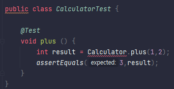
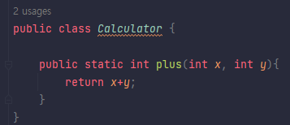

★TDD 적용하기 전 개발 루트
-
1. 만들 기능에 대해 설계 고민 후 어떤 클래스와 인터페이스를 도출할지 고민하고 각 타입에 어떤 메서드를 넣을지 시간을 들여 생각한다.

2. 1번을 수행하면서 구현에 대해서도 고민한다. 어떻게 구현하면 될지 머릿속에 그려지면 코드를 쓰기 시작한다.
3. 기능에 대한 구현을 완료하면 기능을 테스트한다. 원하는 결과가 나오지 않으면 작성한 코드를 디버깅하며 찾는다.

단점
-
1. 작성한 코드가 많으면 디버깅 시간이 길어진다.
2. 테스트 과정이 쉽지 않다.

TDD란?
-
Test Driven Development.

테스트를 먼저 수행하고 개발하는 테스트 주도 개발이다.
테스트를 먼저 수행한다는 것은 기능이 올바르게 동작하는지 검증하는 테스트 코드를 작성한다는 의미다.

💭 구현 코드가 없는데 어떻게 테스트를 먼저 작성하지?
-
제일 이해가 가지 않는 부분이다.
구현체가 없는데 어떻게 테스트를 할까?

테스트 코드 작성⚙️
-

- assertEquals() 메서드는 인자로 받은 두 값이 동일한지 비교하는 메서드다.
- Calculator 란 클래스가 존재하지 않아 컴파일 에러가 발생한다.

-  Calculator 클래스를 만들었다.
- 테스트 코드 개발이 완료되었다면 클래스들을 실제 애플리케이션 로직으로 이용한다.

◆ 테스트 코드를 작성하며 필자는 이런 고민을 했다.
- 
1) 메서드 이름 
2) 파라미터 개수
3) 정적 메서드 OR 인스턴스 메서드
4) 클래스 이름

=> 이런 고민들은 실제 코드를 설계하는 과정과 유사하다.
테스트 코드를 작성한 뒤에 <u>컴파일 오류를 없애는데 필요한 클래스와 메서드를 작성</u>했다.

✨TDD를 정리해보면
-
테스트 코드를 짜고 테스트 코드가 돌아가게 코딩하고, 모든 상황에 작동할 수 있도록 점점 리팩토링 해나간다.

1) 먼저 로직을 생각하고 테스트 코드를 작성한다.
2) 작성한 테스트 코드에 대한 클래스와 메서드 등을 만들어나간다.
3) 리팩토링 한다.
4) 기능을 완성한다.

이것이 TDD다!

장단점
-

장점)
1) 기능이 잘 구현됬을까? 란 불안감이 사라진다.
2) 테스트 코드를 작성함으로써 예상치 못한 변수를 차단하도록 도와준다.

단점)
1) 개발 진행 속도가 느릴 것 같다.