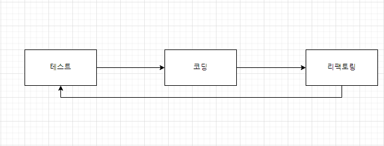

★ Again 정리 ★
-

TDD 흐름 
- 

1. 기능을 검증하는 테스트를 먼저 작성한다.
2. 테스트 통과 못하면 통과할만큼만 코드를 작성한다.(반복)
3. 테스트가 통과하면 리팩토링한다.
4. 리팩토링 후 테스트를 통해 기존 기능이 망가지지 않았는지 확인한다.

<u>이 과정을 반복하면서 점진적으로 기능을 완성해 나가는 것.</u>

문제
-

1. 다음은 리팩토링의 특징에 대해서 설명한 것이다. 내용이 올바르지 않은 것은 무엇인가?

① 리팩토링은 새로운 기능을 추가하는 것은 아니다.

② 패턴을 적용하게 되면 리팩토링은 할 필요가 없다.

③ 복잡한 코드일수록 리팩토링을 해야 할 필요가 있다.

④ 유지보수가 용이하려면 리팩토링을 해야만 한다.

ㅡㅡㅡㅡㅡㅡㅡㅡㅡㅡㅡㅡㅡㅡㅡㅡㅡㅡㅡㅡㅡㅡㅡㅡㅡㅡㅡㅡㅡㅡㅡㅡㅡㅡㅡㅡㅡㅡㅡㅡㅡㅡㅡㅡㅡㅡㅡㅡ

2. TDD를 적용하기 전에 개발자가 고민해야 하는 주요 사항은 무엇인가요?

기능 분석: 개발할 기능을 분석하고 명확하게 이해해야 합니다. 어떤 입력이 주어졌을 때 기능이 어떻게 동작해야 하는지를 파악해야 합니다.

테스트 사항 정의: 각각의 기능에 대한 테스트 사항을 정의해야 합니다. 어떤 조건에서 어떤 결과를 기대하는지를 명확하게 정리해야 합니다. 복잡한 코드일수록 리팩토링을 해야 할 필요가 있다.

설계 고려: 기능을 구현하기 전에 클래스와 메서드의 구조를 고민해야 합니다. 어떤 클래스와 인터페이스가 필요하며, 각각의 메서드는 어떤 기능을 수행해야 하는지를 고려해야 합니다.

ㅡㅡㅡㅡㅡㅡㅡㅡㅡㅡㅡㅡㅡㅡㅡㅡㅡㅡㅡㅡㅡㅡㅡㅡㅡㅡㅡㅡㅡㅡㅡㅡㅡㅡㅡㅡㅡㅡㅡㅡㅡㅡㅡㅡㅡㅡㅡ

3. 다음 코드를 보고 리팩토링하면 좋은 부분을 생각해봅시다.

public class ShoppingCart {

    public double calculateTotalPrice(List<Product> products) {
        double total = 0;
        for (Product product : products) {
            if (product.getStatus().equals("available")) {
                total += product.getPrice();
            }
        }
        return total;
    }
}\
public class Product {
private String status;
private double price;

    // Constructor, getters, setters...
}

내가 한 부분

    public double calculateTotalPrice(List<Product> products) {
        return calculateTotal(products);
    }

    private double calculateTotal(List<Product> products) {
        double total = 0;
        for (Product product : products) {
            if (isProductAvailable(product)) {
                total += product.getPrice();
            }
        }
        return total;
    }

    private boolean isProductAvailable(Product product) {
        return product.getStatus().equals("available");
    }
