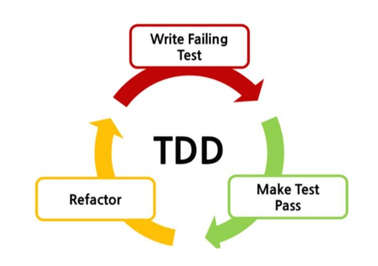

테스트 코드 작성 순서
- 

Chapter02 에서 기능을 구현할 대 테스트 코드를 작성한 순서는 

1) 쉬운 경우에서 어려운 경우로 진행
2) 예외적인 경우에서 정상인 경우로 진행

필자는 어려운 경우로 먼저 시작하거나 정상 상황을 먼저 시작하면
구현 과정이 원활하게 진행되지 않는 경우도 있다고 한다.

왜 그럴까?

★ 초반에 복잡한 테스트부터 시작한다면?
-
필자는 한 번에 완벽한 코드를 만들면 자신도 모르게 버그를 만들고 
 나중에 버그를 잡기 위해 디버깅을 하게 되니 많은 시간을 허비하게 되고
테스트 통과 시간도 길어진다고 말한다.

★ 구현하기 쉬운 테스트부터 시작하기
- 
보통 수 분에서 십여 분 이내에 구현을 완료해서 테스트를 통과시킬 수 있을 만큼 쉬운 것을 선택한다.

하나의 테스트를 통과하면 그 다음으로 구현하기 쉬운 테스트를 선택하고 점진적으로 구현을 완성해나가야된다.

쉬운 테스트부터 구현해나가면 작성한 코드가 많지 않아 디버깅에도 유리하다.

★ 예외 상황을 먼저 테스트하는 이유
- 
예외상항을 고려하지 않은 상황에서 예외상황을 추가하면 코드를 뒤집거나 조건문을 중복해서 추가하는 경우가 생길 수 있다.
이는 코드를 복잡하게 해 버그 발생 가능성을 높인다.

TDD를 하는 동안 예외 상황을 찾고 테스트에 반영하면 예외 상황을 처리하지 않아 발생하는 버그도 줄인다.

★ 완급 조절
- 
처음 TDD로 구현할 때 어려운 것 : 한 번에 얼마만큼의 코드를 작성할 것인가? 이다.

따라서 아래와 같은 단계로 TDD를 연습하는 것이 좋다.

1. 정해진 값을 리턴
2. 값 비교를 이용해서 정해진 값을 리턴
3. 다양한 테스트를 추가하면서 구현을 일반화

테스를 만들고 통과시키는 과정에서 구현이 막힐 땐
위 단계를 이용해 조금씩 기능을 구현해 나가자.

★ 지속적인 리팩토링
- 
- 코드 중복
- 코드가 길어지면 메서드 추출과 같은 기법을 사용해 메서드 이름으로 코드의 의미를 표현한다.

리팩토링을 왜 하는가? 

일단 동작하는 코드를 만들고 시간이 지나면 변화를 요구할 때 코드 변경이 이루어진다. 이 때 코드 변경이 어려우면 변화하는 요구를 제때 반영할 수 없게 된다.
따라서 코드를 잘 변경하려면 변경하기 쉬운 구조를 가져야하고 이를 위한 것이 리팩토링이다.

★ 리팩토링 시점
-

- 구현의 전반적인 흐름을 명확히 파악했을 때 메서드 추출 같은 리팩토링을 진행한다.

ㅡㅡㅡㅡㅡㅡㅡㅡㅡㅡㅡㅡㅡㅡㅡㅡㅡㅡㅡㅡㅡㅡㅡㅡㅡㅡㅡㅡㅡㅡㅡㅡㅡㅡㅡㅡㅡㅡㅡㅡㅡㅡㅡㅡ

문제
- 

테스트 주도 개발(TDD)에서 초기 테스트 코드 작성 시 추천되는 접근법은 무엇입니까?

1) 가장 복잡한 테스트 케이스로 시작한다.
2) 가장 쉬운 테스트 케이스로 시작한다.
3) 무작위 순서로 테스트 케이스를 선택한다.
4) 모든 테스트 케이스를 동시에 개발한다.

테스트 주도 개발에서 예외 상황을 먼저 테스트하는 이유는 무엇입니까?

1) 예외 상황이 가장 흔하게 발생하기 때문이다.
2) 예외 상황을 테스트하는 것이 가장 쉬우므로 빠른 성공 경험을 제공한다.
3) 예외 상황을 테스트하는 것이 가장 어렵기 때문에 먼저 처리하는 것이 좋다.
4) 예외 상황을 먼저 테스트하면 나중에 코드를 전면적으로 수정할 필요가 없어진다.

ㅡㅡㅡㅡㅡㅡㅡㅡㅡㅡㅡㅡㅡㅡㅡㅡㅡㅡㅡㅡㅡㅡㅡㅡㅡㅡㅡㅡㅡㅡㅡㅡㅡㅡㅡㅡㅡㅡㅡㅡ

위 그림은 TDD 개발 주기를 표현한 것이다. 공백을 채우시오.

Red 단계에서는 ____ _____를 먼저 작성한다.
Green 단계에서는 _____를 _____ 위한 실제 코드를 작성한다.
Yellow 단계에서는 중복 코드 제거, 일반화 등의 ____을 수행한다.

ㅡㅡㅡㅡㅡㅡㅡㅡㅡㅡㅡㅡㅡㅡㅡㅡㅡㅡㅡㅡㅡㅡㅡㅡㅡㅡㅡㅡㅡㅡㅡㅡㅡㅡㅡㅡㅡㅡㅡㅡㅡㅡ