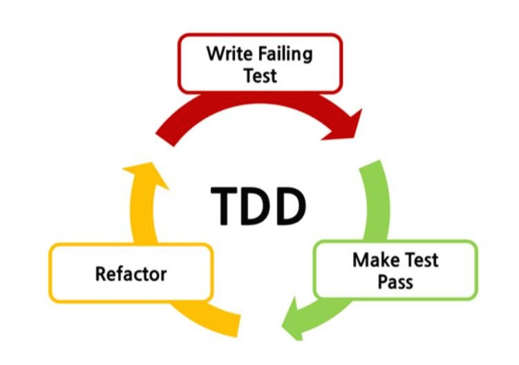

문제1. TDD의 주요 목적이 무엇인가?
=

1) 코드를 최대한 빨리 작성하는 것

2) 새로운 프로젝트의 아키텍처를 설계하는 것

3) 코드의 성능을 최적화하는 것

4) 기능 개발을 용이하게 하기 위해 문서화하는 것

5) 테스트 코드를 작성함으로써 기능 코드의 동작을 보장하는 것

답 : 5 

문제2. 다음은 리팩토링의 특징에 대해서 설명한 것이다. 내용이 올바르지 않은 것은 무엇인가?
=

1) 리팩토링은 새로운 기능을 추가하는 것은 아니다.

2) 패턴을 적용하게 되면 리팩토링은 할 필요가 없다.

3) 복잡한 코드일수록 리팩토링을 해야 할 필요가 있다.

4) 유지보수가 용이하려면 리팩토링을 해야만 한다.

답 : 2

문제3. TDD를 적용하기 전에 개발자가 고민해야 하는 주요 사항은 무엇인가요? 자유롭게 생각하고 이야기해봅시다.
=

기능 분석: 개발할 기능을 분석하고 명확하게 이해해야 합니다. 어떤 입력이 주어졌을 때 기능이 어떻게 동작해야 하는지를 파악해야 합니다.

테스트 사항 정의: 각각의 기능에 대한 테스트 사항을 정의해야 합니다. 어떤 조건에서 어떤 결과를 기대하는지를 명확하게 정리해야 합니다.

설계 고려: 기능을 구현하기 전에 클래스와 메서드의 구조를 고민해야 합니다. 어떤 클래스와 인터페이스가 필요하며, 각각의 메서드는 어떤 기능을 수행해야 하는지를 고려해야 합니다.

문제4. 다음 코드를 보고 리팩토링하면 좋은 부분을 생각해봅시다.
= 

    public class ShoppingCart {

    public double calculateTotalPrice(List<Product> products) {
        double total = 0;
        for (Product product : products) {
            if (product.getStatus().equals("available")) {
                total += product.getPrice();
            }
        }
        return total;
        }
    }

    public class Product {
        private String status;
        private double price;

    // Constructor, getters, setters...
    }

제가 짠 코드입니다.
    
    public double calculateTotalPrice(List<Product> products) {
        return calculateTotal(products);
    }

    private double calculateTotal(List<Product> products) {
        double total = 0;
        for (Product product : products) {
            if (isProductAvailable(product)) {
                total += product.getPrice();
            }
        }
        return total;
    }

    private boolean isProductAvailable(Product product) {
        return product.getStatus().equals("available");
    }

문제 5. 테스트 주도 개발(TDD)에서 초기 테스트 코드 작성 시 추천되는 접근법은 무엇입니까?
=

1) 가장 복잡한 테스트 케이스로 시작한다.
2) 가장 쉬운 테스트 케이스로 시작한다.
3) 무작위 순서로 테스트 케이스를 선택한다.
4) 모든 테스트 케이스를 동시에 개발한다.

답 : 2번

문제 6. 테스트 주도 개발에서 예외 상황을 먼저 테스트하는 이유는 무엇입니까?
=

1) 예외 상황이 가장 흔하게 발생하기 때문이다.
2) 예외 상황을 테스트하는 것이 가장 쉬우므로 빠른 성공 경험을 제공한다.
3) 예외 상황을 테스트하는 것이 가장 어렵기 때문에 먼저 처리하는 것이 좋다.
4) 예외 상황을 먼저 테스트하면 나중에 코드를 전면적으로 수정할 필요가 없어진다.

답 : 4

문제 7. 위 그림은 TDD 개발 주기를 표현한 것이다. 공백을 채우시오.
=

1) Red 단계에서는 ____ _____를 먼저 작성한다.
2) Green 단계에서는 _____를 _____ 위한 실제 코드를 작성한다.
3) Yellow 단계에서는 중복 코드 제거, 일반화 등의 ____을 수행한다.

답 : 실패하는 테스트코드 / 테스트코드, 성공시키기 / 리팩토링