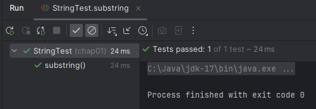

# JUnit5 라이브러리를 이용한 첫 Test
intelliJ 프로젝트에서 진행함.
```java
package chap01;

import org.junit.jupiter.api.Assertions;
import org.junit.jupiter.api.Test;

public class StringTest {

    @Test
    void substring() {
        String str = "abcde";
        Assertions.assertEquals("cd", str.substring(2, 4));
    }
}

```


## Gradle JUnit 설정
필요 시, 확인을 위한 Gradle 설정도 작성해둠.
```gradle
dependency {
    testImplementation('org.junit.jupiter:junit-jupiter:5.5.0')
}
```