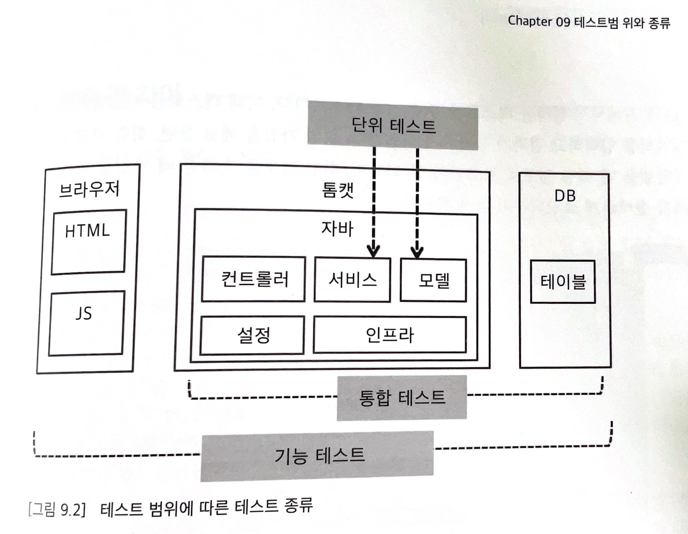

# 객관식 문제

## 1. 테스트하기 어려운 코드의 예가 아닌 것은 무엇인가?
<details>
<summary>답안</summary>
답: 3
</details>

1. 하드 코딩된 경로
2. 의존 객체를 직접 생성
3. 객체 지향 설계를 적용한 코드
4. 정적 메서드 사용

## 2. 다음 중 외부 라이브러리를 테스트 가능하게 만들기 위한 방법으로 옳은 것은 무엇인가?
<details>
<summary>답안</summary>
답: 2
</details>

1. 외부 라이브러리를 직접 사용한다.
2. 외부 라이브러리를 감싸는 타입을 따로 만든다.
3. 외부 라이브러리를 주입하지 않고 하드코딩한다.
4. 외부 라이브러리의 정적 메서드를 그대로 사용한다.

## 3. 다음 중 의존 대상을 주입받아 테스트 가능한 코드를 작성하는 방법으로 적절하지 않은 것은 무엇인가? 
<details>
<summary>답안</summary>
답: 3
</details>

1. 생성자를 통해 의존 대상을 주입한다.
2. 세터를 통해 의존 대상을 주입한다.
3. 의존 대상을 주입받지 않고 직접 생성한다. 
4. 인터페이스를 사용해 의존 대상을 주입한다.

## 4. 다음 중 기능 테스트에 대한 설명으로 옳지 않은 것은 무엇인가요?
<details>
<summary>답안</summary>
답: 4

해설: 개별 코드나 컴포넌트가 기대한대로 동작하는지 확인하는 것은 단위 테스트(Unit Test)입니다. 기능 테스트는 시스템의 전체 기능을 사용자 관점에서 검증하는 것이므로 개별 코드나 컴포넌트가 아닌 전체 시스템의 동작을 확인합니다.
</details>

1. 기능 테스트는 사용자 입장에서 시스템이 제공하는 기능이 올바르게 동작하는지 확인한다.
2. 기능 테스트를 수행하기 위해서는 모든 구성 요소가 필요하다. 
3. 기능 테스트는 웹 브라우저부터 시작해 DB까지 모든 구성 요소를 테스트하기 때문에 E2E(End to End) 테스트로도 본다. 
4. 기능 테스트는 개별 코드나 컴포넌트가 기대한대로 동작하는지 확인한다.

## 5. 통합테스트에 대한 설명으로 옳지 않은 것은 무엇인가요?
<details>
<summary>답안</summary>
정답: 2

해설: 통합 테스트는 소프트웨어의 코드를 직접 테스트하는 것이 아니라, 시스템의 각 구성 요소가 올바르게 연동되는지 확인하는 것입니다. 소프트웨어의 코드를 직접 테스트하는 것은 주로 단위 테스트(Unit Test)에서 이루어집니다.
</details>

1. 통합 테스트는 시스템의 각 구성 요소가 올바르게 연동되는지 확인한다.
2. 통합 테스트는 소프트웨어의 코드를 직접 테스트한다.
3. 통합 테스트는 외부 시스템과 연동해야 하는 기능을 테스트하는 것이다. 
4. 통합 테스트는 각 구성 요소가 올바르게 연동되는지 확인하기 때문에 자동화하기 좋은 수단이다.


# 주관식 문제

## 6. 다음 코드를 보고, 의존 대상을 주입받아 테스트 가능하도록 수정하세요. 생성자를 이용한 방법을 작성해보세요.

<details>
<summary>답안</summary>

생성자를 통한 의존성 주입을 한다면
UserService 클래스의 생성자가 UserDao 객체를 매개변수로 받아 초기화합니다.

이를 통해 UserService 객체가 생성될 때 UserDao 객체를 주입할 수 있습니다.


<테스트 코드 예시 - 답>

```java
    // UserDao 클래스의 대역을 생성하여 테스트
    class MockUserDao extends UserDao {
    
       @Override
       public User findById(String id) {
           if ("testUser".equals(id)) {
           return new User("testUser");
           }
           return null;
       }
    }

    public class UserServiceTest {
        @Test
        public void testGetUser() {
            // 임시 MockUserDao 사용
            UserDao mockUserDao = new MockUserDao();

            // UserService에 MockUserDao 주입
            UserService userService = new UserService(mockUserDao);

            // 테스트 실행 및 검증
            User user = userService.getUser("testUser");
            assertNotNull(user);
            assertEquals("testUser", user.getId());
        }
    }
```
   
</details>

```java
public class UserService {
            private UserDao userDao = new UserDao(); // 의존 객체를 직접 생성

            public User getUser(String id) {
            return userDao.findById(id);
            }
        }
        
        // 생성자를 통한 의존성 주입 코드
        public class UserService {
            private UserDao userDao;

        // 생성자를 통한 의존성 주입
        public UserService(UserDao userDao) {
            this.userDao = userDao;
        }

        public User getUser(String id) {
            return userDao.findById(id);
    }
}
```

# 7. 테스트 범위에 따른 연동 대상을 짝지으시오.
<details>
<summary>답안</summary>

답
```text
통합테스트 - a - c / 단위테스트 - b - d
```

해설
```text
통합테스트: DB 연결, 소켓 통신, 스프링 컨테이너 초기화와 같이 테스트 실행 속도를 느리게 만드는 요인이 많다.
단위테스트: 테스트 대상이 의존하는 기능을 대역으로 처리하면 되므로 테스트 실행 속도가 빠르다.
```


</details>

---

```text
통합테스트 - (a/b) - (c/d)
단위테스트 - (a/b) - (c/d)

--------------------------------

a: 실제 DB 사용
b: 대역 사용

c: 테스트 실행 속도 비교적 느림
d: 테스트 실행 속도 비교적 빠름
```

# 8. 모의 객체 중 실제로 모의 객체가 불렸는지 검증하는 코드이다. <br/> 다음 중 빈칸에 들어갈 코드를 작성하시오.

<details>
<summary>답안</summary>

```text

```
</details>

```java

```


# 9. 단위 테스트를 실행하다보면 모의 객체를 호출할 때 사용한 인자를 검증해야 할 때가 있다. <br/> ArgumentCaptor를 사용하면 메서드 호출 여부를 검증하는 과정에서 실제 호출할 때 전달한 인자를 보관할 수 있다. <br/> 이러한 방식처럼 호출된 내역을 기록하고, 테스트 결과를 검증할 때 사용하는 '대역의 종류'는 무엇인가?
<details>
<summary>답안</summary>
spy(스파이)
</details>

# 10. 스텁을 설정한 인자가 두 개인 메서드가 있다. 임의의 정수 값과 정확한 값에 대해서 기대 값을 설정했다. <br/> 그러나 해당 코드는 exception이 발생하고 있다. <br/> 오류를 찾아 수정하시오.

<details>
<summary>답안</summary>

```java
given(mockList.set(anyInt(), eq("123"))).willReturn("456");
```
</details>

```java
List<String> mockList = mock(List.class);
given(mockList.set(anyInt(), "123”)).willReturn("456");
String old = mocoList.set(5, "123");
```