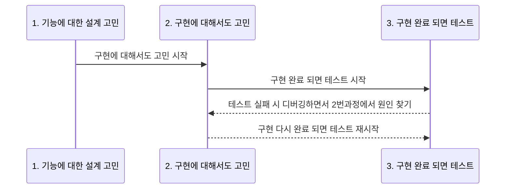
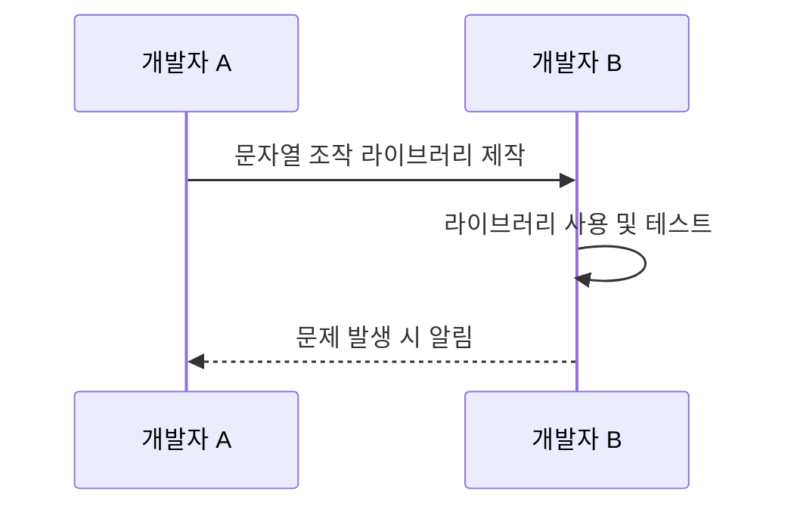
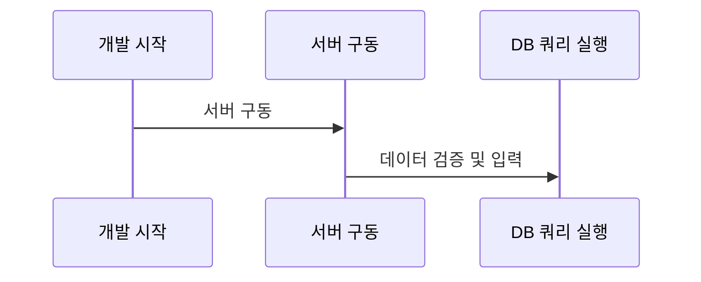
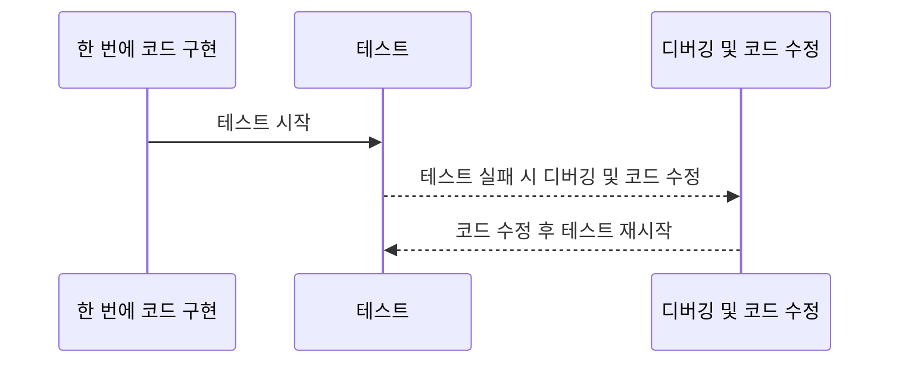
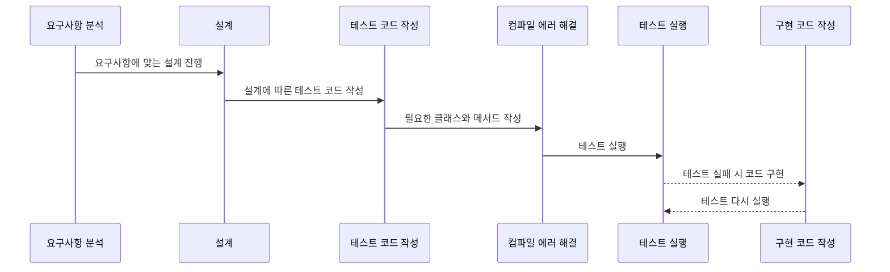

## TDD 1장 2장 정리

TDD는 Test-Driven Development의 약자로 우리 말로는 `테스트 주도 개발` 이라고 표현한다.

- 자바로 프로그래밍하려면 JDK가 필요하듯 TDD를 하려면 지정한 방식으로 코드를 작성하고 실행할 수 있는 도구가 필요하다.
- TDD를 위한 다양한 도구가 존재하는데 자바에서는 주로 JUnit을 사용함
- JUnit과 TDD에 대한 내용은 2장부터
- 이장에서는 JUnit 실행 환경 만들어봄

*책에서는 JUnit5버전을 사용한다.

## 프로젝트에서 JUnit 설정

이 절에서는 인텔리제이 프로젝트에서 JUnit을 설정하는 방법을 살펴본다

- JUnit 5는 자바 8 버전 이상을 사용해야 함
- 자바 프로젝트를 생성 할 때 프로젝트 런타임으로 자바 8 이나 그 이상 버전을 사용해야 함.


자바 21버전으로 테스트

```groovy
plugins {
    id 'java'
}

group = 'org.example'
version = '1.0-SNAPSHOT'

repositories {
    mavenCentral()
}

dependencies {
		//JUnit 5버전 최신 implement
    testImplementation platform('org.junit:junit-bom:5.10.0')
    testImplementation 'org.junit.jupiter:junit-jupiter'
}

test {
		//JUnit 5로 작성된 테스트 코드를 실행하기 위해 설정
    useJUnitPlatform()
    testLogging{
        events "passed","skipped","failed"
    }
}
```

### 예시 테스트 코드

```java
package chap01;

import static org.junit.jupiter.api.Assertions.*;

import org.junit.jupiter.api.Test;
public class StringTest {

    @Test
    void substring(){
        String str = "abcde";
        System.out.println(str.substring(2,4));
        assertEquals("cd",str.substring(2,4));

    }
}

```

## TDD 이전의 개발 문제점

1. 개발할 기능에 대한 설계 고려
    - 필요한 클래스와 인터페이스 도출에 고민
    - 각 타입에 적합한 메소드 결정에 시간 소요
2. 설계 단계에서 구현에 대해 고민
    - 대략적인 구현 방향을 생각하고 코드 작성 시작
3. 기능 구현 완료 후 테스트 진행
    - 동작에 문제가 있거나 예상치 못한 문제 발생시, 작성한 코드를 디버깅하여 원인 파악



- 과정 2에서 한 번에 많은 코드를 작성하면 디버깅 시간이 길어짐.
    - 원인을 찾기 위해 많은 코드를 검색해야 함.
    - 디버깅을 위한 로그 메시지를 추가하고, 개발 도구의 디버거를 이용해 코드를 한 줄씩 따라가면서 원인을 찾는다.
    - 버그를 찾는 시간이 처음 코드를 작성한 시간보다 더 오래 걸리는 경우도 있다.
- 코드를 작성하는 개발자와 테스트하는 개발자가 다른 경우도 있다.
    - 예를 들어, 개발자 A가 문자열을 조작하는 라이브러리를 만들면, 개발자 B가 그 라이브러리를 사용하여 테스트하고 문제가 있으면 A에게 알려줌.



- 테스트 과정이 번거롭고 복잡하다
    1. 웹 어플리케이션 개발 시작
    2. 기능 테스트를 위해 톰캣 서버 구동
    3. 클래스 파일 변경 시 톰캣 서버 재시작 필요 (시간 소요)
    4. 데이터 정확성 검증을 위해 DB 접속 및 SELECT 쿼리 실행
    5. 아이디 중복 기능 테스트를 위해 INSERT 쿼리로 데이터 미리 입력



- 경력이 쌓일수록 숙련도가 높아져 버그를 찾는 시간이 줄어들지만, 예상치 못한 오류가 발생하면 그 원인을 찾기 위해 많은 코드를 검토해야 한다.



- 책의 저자는 위와 같은 문제로 TDD를 접한 후 개발 속도가 빨라 졌다고 함.
- TDD 덕분에 예전보다 더 나은 코드를 짧은 시간에 만들 수 있게 되었다고 함.

## TDD 란?

- `TDD`는 테스트부터 시작함
    - 구현을 먼저 하고 나중에 테스트하는 것이 아니라 `먼저 테스트`를 하고 그 다음에 구현한다.
    
- 구현 코드가 없는데 어떻게 구현 가능?
    - 여기서 테스트를 먼저 한다는 것은 기능이 올바르게 동작하는지 검증하는 테스트 코드를 작성한다는 것을 의미
    - 기능을 검증하는 `테스트 코드를 먼저 작성`하고 `테스트를 통과시키기 위해 개발을 진행`한다.

### 예시로 간단한 덧셈 기능 TDD 구현

- 코드는 인텔리제이 `gradle`환경에서 진행

- 테스트 코드

```java
package chap02;

import org.junit.jupiter.api.Test;

import static org.junit.jupiter.api.Assertions.assertEquals;

public class CalculatorTest {

    @Test
    void plus(){
        int result = Calculator.plus(1,2);
        assertEquals(3,result);
    }
}

```

- 이 코드를 작성하면 `int result = Calculator.plus(1,2);` 이 부분에서 `Calculator` 클래스가 없어 컴파일 에러가 발생한다.
    - 아직 Calculator 클래스를 작성하지 않았으므로, 이 에러는 예상 가능한 것.
    - 컴파일 에러를 해결하기 전에 코드를 살펴보자.
- `@Test`
    - JUnit은 `@Test` 애노테이션을 붙인 Plus() 메소드를 `테스트 메서드`로 인식한다.
    - `테스트 메서드`는 **기능을 검증하는 코드를 포함하는 메서드**.
- `int result = Calculator.plus(1,2);`
    - 이 부분은 계산 기능을 실행하는 코드.
- `assertEquals(3,result);`
    - 이 부분은 계산 결과가 예상한 값인지 검증하는 코드.
    - assertEquals() 메서드는 두 인자가 동일한지 비교.
    - 여기서 **첫 번째 인자**는 `기대한 값(Expected)`, **두 번째 인자**는 `실제 값(Actual)`.
        - 즉, `assertEquals() 메서드`는 `기대한 값(Expected)`과 `실제 값(Actual)`이 **동일한지 비교하는 메서드**.
        - 두 값이 동일하지 않으면 AssertionFailedError가 발생.
- 특히 주목해야 할 코드는 `int result = Calculator.plus(1,2);` 부분.
    - 이 부분은 아직 존재하지 않는 Calculator 클래스와 plus 메소드를 사용하여 작성되었다.
    - 덧셈 기능을 제공하는 클래스와 메서드의 이름을 결정하기 위해 `Calculator`와 `plus`라는 이름을 선택.
    - 이 이름과 다음 코드를 작성하기 위해 고려한 사항은 다음과 같다:
        - 메서드 이름은 덧셈이니 plus 또는 sum으로 결정할 것인가?
        - 덧셈 기능을 제공하는 메서드의 파라미터는 몇 개이며, 파라미터 타입은 무엇이며, 반환 값은 무엇인가?
        - 메서드는 정적 메서드로 구현할 것인가, 아니면 인스턴스 메서드로 구현할 것인가?
        - 메서드를 제공할 클래스의 이름은 무엇인가?
    - 아직 Calculator 클래스를 작성하지 않았으니 당연히 컴파일 에러가 발생한다.
    - 컴파일 에러를 없애기 전 코드를 살펴보자.

- **위 테스트 코드를 통해 구현한 코드**

```java
package chap02;

public class Calculator {
    public static int plus(int num1, int num2){
        return num1 + num2;
    }
}

```

- 책의 저자는 다음과 같은 생각으로 해당 코드를 작성했다
    - 수학에서 더하기 부호를 의미하는 이름이 더 어울릴 것 같아 `plus` 메서드로 이름 정함
    - `두 값을 더하는 기능`이므로 파라미터는 두 개로 정함. 두 파라미터의 타입은 일단은 `int`로 정함. 반환할 값은 두 파라미터의 덧셈 결과로 정함.
    - 현재는 덧셈 기능을 구현하기 위해 `새로운 객체를 만들 필요는 없다.` 나중에 어떤 기능이 추가 될지 모르지만 지금 당장은 `정적 메서드`로 충분함. 그래서 plus는 `정적 메서드`로 만듬.
    - plus 메서드를 제공할 클래스 이름은 단순히 계산기를 의미하는` Calculator`로 정함
    
- 위 과정에서 일부러 에러를 발생 시켜 `기대한 값(Expected)`와 `실제 값(Actual)`이 어떤 식으로 들어오는지 확인해야 한다.
  
  
    예를 들어 
    
    ```java
    package chap02;
    
    public class Calculator {
        public static int plus(int num1, int num2){
            return 0;
        }
    }
    
    ```
    


에러 결과 기대한 값과 실제 값이 틀려 에러가 발생하고 어디서 에러가 발생하는지 보여준다.

- 처음에 `TDD`를 접할 때는 작은 단계를 차근 차근 밟아 나가야 함
- 그렇지 않으면 `TDD`를 몸에 익히는데 어려움을 겪을 수 있다.

이제 성공하는 결과로 작성하여 테스트

```java
package chap02;

public class Calculator {
    public static int plus(int num1, int num2){
        return 3;
    }
}

```


성공한 테스트 결과

여기서 또 assertEquals() 케이스를 추가해서 계속해서 테스트

```java
package chap02;

import org.junit.jupiter.api.Test;

import static org.junit.jupiter.api.Assertions.assertEquals;

public class CalculatorTest {

    @Test
    void plus(){
        int result = Calculator.plus(1,2);
        assertEquals(3,result);
        //추가한 assertEquals()메서드
        assertEquals(5,Calculator.plus(4,1));
    }
}
```


또 다른 에러 사항

이런 식으로 점진적으로 기능을 구현해서 완성해 나가는데, 덧셈 예는 단순하므로 다시 plus메서드 구현을 수정함

```java
package chap02;

public class Calculator {
    public static int plus(int num1, int num2){
        return num1 + num2;
    }
}

```


수정 후 정상적으로 실행되는 것을 확인 가능

- 만약 Calculator 클래스를 `src/test/java` 쪽에 생성하고, 모든 기능이 정상적으로 동작한다면 배포를 위해 `src/main/java` 폴더로 이동 시켜야 한다.
    - `src/test/java` 소스 폴더는 배포 대상이 아니므로 `src/main/java` 폴더에 코드를 만들면 완성되지 않는 코드가 배포되는 것을 방지하는 효과가 있다.

- TDD는 기능을 검증하는 테스트 코드를 먼저 만든다.
    - 덧셈 예제에서는 덧셈 기능을 검증하는 테스트 코드를 먼저 작성했다.
    - 이 과정에서 테스트 대상이 될 클래스 이름, 메서드 이름, 파라미터 개수, 리턴 타입을 고민했다.
    - 또한 새로운 객체를 생성할지 아니면 정적 메소드로 구현할지 등을 함께 고민했다.
    - 이러한 고민 과정은 실제 코드를 설계하는 과정과 유사함.
- 테스트 코드를 작성한 뒤에는 컴파일 오류를 없애는 데 필요한 클래스와 메서드를 작성했다.
    - 바로 테스트를 실행했고 테스트에 실패했다. 실패한 이유를 확인하고 단순히 기대 값과 동일한 실제 값으로 작성하여 테스트를 통과할 만큼만 코드를 구현했다.
    - 실패한 테스트를 통과시킨 뒤에 새로운 테스트를 추가하여 다시 그 테스트를 통과 시키기 위해 코드를 작성했다.
    - 이런 식으로 TDD는 테스트를 먼저 작성하고 테스트에 실패하면 테스트를 통과 시킬 만큼 코드를 추가하는 과정을 반복하면서 점진적으로 기능을 완성해 나간다.(프로그래머스 코드 테스트 과정과 유사하다.)
    



### TDD 예시: 암호 강도 측정기

암호 강도 측정기는 주어진 문자열이 각 조건을 만족하는지를 검사하여 암호의 강도를 `약함`, `보통`, `강함` 중 하나로 분류

**암호 강도 측정기 요구 사항:**

- 세 가지 규칙을 기반으로 암호를 검사:
    - 암호의 길이가 `8글자 이상`인지
    - `0부터 9`사이의 `숫자가 포함`되어 있는지
    - `대문자가 포함`되어 있는지
- 세 규칙을 모두 충족하면 암호는 `강함`으로 분류.
- 두 개의 규칙을 충족하면 암호는 `보통`으로 분류.
- 하나 혹은 그 이하의 규칙만 충족하면 암호는 `약함`으로 분류.

테스트할 기능의 이름을 정하는 것부터 시작함.

 `강함`, `보통`, `약함`으로 구분 되므로 `암호 등급` 또는 `암호 강도`라는 이름을 고려할 수 있다. 이를 영어로 표현하면 `passwordLevel` 혹은 `passwordStrength`라고 할 수 있습니다.

암호 강도를 측정하겠다는 의미를 표현하는 단어를 찾아보자. `Checker`보다는 `Meter`를 더 많이 사용하므로 `PasswordStrengthMeter`라는 클래스 이름으로 결정.

```java
package chap02;

import org.junit.jupiter.api.Test;

public class PasswordStrengthMeterTest {
    @Test
    void name(){

    }
}
```

- `아무 검증도 하지 않는 테스트 메서드`를 하나 만듬
    - 이 상태에서 테스트를 실행한다. 당연히 통과할 것이다.
    - 이렇게 빈 테스트 메서드를 실행하는 것 이 불필요한 행위 같지만, 테스트를 실행할 수 있는 환경을 갖추었는지 확인 할 수 있으므로 나름대로 의미가 있다.

## 첫번째 테스트: 모든 규칙을 충족하는 경우

- 테스트 주도 개발(TDD)에서 `첫 번째 테스트`를 선택하는 것은 중요하다.
- 가장 쉬운 상황이나 예외적인 상황을 먼저 선택해야 한다.
- 암호 검사 기능에서 모든 규칙을 충족하거나 충족하지 못하는 경우 두 가지 상황이 있을 수 있다.
    - `모든 규칙을 충족하지 못하는 경우`에는 모든 조건을 검사하는 코드를 구현해야 하므로, 첫 번째 테스트를 통과하는 데 시간이 많이 걸릴 수 있다.
    - 반면에 모든 규칙을 충족하는 경우에는 `강함`에 해당하는 값을 리턴하면 테스트를 쉽게 통과할 수 있다. 따라서, 첫 번째 테스트로 `모든 조건을 충족`하는 경우를 선택하는 것이 좋다.

```java
package chap02;

import org.junit.jupiter.api.Test;

import static org.junit.jupiter.api.Assertions.assertEquals;

public class PasswordStrengthMeterTest {
    @Test
    void meetsAllCriteria_Then_Strong(){
        PasswordStrengthMeter meter = new PasswordStrengthMeter();
        PasswordStrength result = meter.meter("ab12!@AB");
        assertEquals(PasswordStrength.STRONG, result);
    }
}

```

컴파일 에러를 없애도록 클래스들을 만든다.

```java
package chap02;

public class PasswordStrengthMeter {
    public PasswordStrength meter(String s){
        return null;
    }
}

```

```java
package chap02;

public enum PasswordStrength {
    STRONG
}

```

당연히 테스트에는 실패한다.

```java
package chap02;

public class PasswordStrengthMeter {
    public PasswordStrength meter(String s){
        return PasswordStrength.STRONG;
    }
}
```

테스트를 통과하도록 바꾼다.

```java
package chap02;

import org.junit.jupiter.api.Test;

import static org.junit.jupiter.api.Assertions.assertEquals;

public class PasswordStrengthMeterTest {
    @Test
    void meetsAllCriteria_Then_Strong(){
        PasswordStrengthMeter meter = new PasswordStrengthMeter();
        PasswordStrength result = meter.meter("ab12!@AB");
        assertEquals(PasswordStrength.STRONG, result);
        PasswordStrength result2 = meter.meter("abc1!Add");
        assertEquals(PasswordStrength.STRONG, result2);
    }
}
```

코드를 추가하고 테스트를 실행해도 통과된다.

## 두번째 테스트: 길이만 8글자 미만이고 나머지 조건은 충족

```java
    @Test
    void meetsOtherCriteria_except_for_Length_Then_Normal(){
        PasswordStrengthMeter meter = new PasswordStrengthMeter();
        PasswordStrength result = meter.meter("ab12!@A");
        assertEquals(PasswordStrength.NORMAL, result);
    }

```

`PasswordStrength`에 `NORMAL` 열거 타입을 추가한다.

테스트는 실패하므로 meter() 가 `NORMAL`을 리턴하도록 수정한다. 그런데 그러면 앞의 테스트가 통과하지 못하므로 코드를 수정한다.

```java
package chap02;

public class PasswordStrengthMeter {
    public PasswordStrength meter(String s){
        if(s.length()<8){
            return PasswordStrength.NORMAL;
        }
        return PasswordStrength.STRONG;
    }
}

```

통과한다.

## 세번째 테스트: 숫자를 포함하지 않고 나머지 조건은 충족

```java
    @Test
    void meetsOtherCriteria_except_for_number_Then_Normal(){
        PasswordStrengthMeter meter = new PasswordStrengthMeter();
        PasswordStrength result = meter.meter("ab!@ABqwer");
        assertEquals(PasswordStrength.NORMAL,result);
    }

```

```java
package chap02;

public class PasswordStrengthMeter {
    public PasswordStrength meter(String s){
        if(s.length()<8){
            return PasswordStrength.NORMAL;
        }

        boolean containsNum = false;
        for(char ch: s.toCharArray()){
            if(ch>='0' && ch<='9'){
                containsNum=true;
                break;
            }
        }
        if(!containsNum) return PasswordStrength.NORMAL;
        return PasswordStrength.STRONG;
    }
}

```

테스트에 성공한다. 리팩토링 해보자.

```java
package chap02;

public class PasswordStrengthMeter {
    public PasswordStrength meter(String s){
        if(s.length()<8){
            return PasswordStrength.NORMAL;
        }
        boolean containsNum = meetsContainingNumberCriteria(s);
        if(!containsNum) return PasswordStrength.NORMAL;
        return PasswordStrength.STRONG;
    }

    private static boolean meetsContainingNumberCriteria(String s) {
        for(char ch: s.toCharArray()){
            if(ch>='0' && ch<='9'){
                return true;
            }
        }
        return false;
    }
}

```

## 테스트 코드 정리

```java
private static final PasswordStrengthMeter meter = new PasswordStrengthMeter();

```

각각의 메서드에서 객체를 생성하는 코드의 중복을 없애기 위해 필드에서 객체를 생성한다.

암호 강도 측정 기능을 실행하고 확인하는 코드의 중복도 제거한다.

```java
package chap02;

import org.junit.jupiter.api.Test;
import static org.junit.jupiter.api.Assertions.assertEquals;

public class PasswordStrengthMeterTest {
    private static final PasswordStrengthMeter meter = new PasswordStrengthMeter();
    private static void assertStrength(String password, PasswordStrength expStr) {
        PasswordStrength result = meter.meter(password);
        assertEquals(expStr, result);
    }

    @Test
    void meetsAllCriteria_Then_Strong(){
        assertStrength("ab12!@AB", PasswordStrength.STRONG);
        assertStrength("abc1!Add", PasswordStrength.STRONG);
    }

    @Test
    void meetsOtherCriteria_except_for_Length_Then_Normal(){
        assertStrength("ab12!@A", PasswordStrength.NORMAL);
        assertStrength("Ab12!c", PasswordStrength.NORMAL);

    }

    @Test
    void meetsOtherCriteria_except_for_number_Then_Normal(){
        assertStrength("ab!@ABqwer", PasswordStrength.NORMAL);
    }

}

```

## 4. 값이 없는 경우

```tsx
 @Test
    void nullInput_Then_Invalid(){
        assertStrength(null, PasswordStrength.INVALID);
    }

```

NullPointerException 이 발생하며 테스트는 당연히 실패한다.

meter() 메소드에 아래와 같이 추가한다.

```java
if(s==null) return PasswordStrength.INVALID;

```

```java
  @Test
    void emptyInput_Then_Invalid(){
        assertStrength("", PasswordStrength.INVALID);
    }

```

```java
if(s==null || s.isEmpty()) return PasswordStrength.INVALID;// 추가
```

## 5. 대문자를 포함하지 않고 나머지 조건을 충족

```java
    @Test
    void meetsOtherCriteria_except_for_Uppercase_Then_Normal(){
        assertStrength("ab12!@df", PasswordStrength.NORMAL);
    }

```

```java
    public PasswordStrength meter(String s){
        if(s==null || s.isEmpty()) return PasswordStrength.INVALID;
        if(s.length()<8){
            return PasswordStrength.NORMAL;
        }
        boolean containsNum = meetsContainingNumberCriteria(s);
        if(!containsNum) return PasswordStrength.NORMAL;

        boolean containsUpp = meetsContainingUppercaseCriteria(s);
        if(!containsUpp) return PasswordStrength.NORMAL;
        return PasswordStrength.STRONG;
    }

    private boolean meetsContainingUppercaseCriteria(String s) {
        for(char ch: s.toCharArray()){
            if(Character.isUpperCase(ch)){
                return true;
            }
        }
        return false;
    }

```

메서드 추출로 코드를 정리했다. 테스트가 성공한다.

## 6. 길이가 8글자 이상인 조건만 충족

```java
    @Test
    void meetsOnlyLengthCriteria_Then_Weak(){// 길이 조건은 충족하고 나머지 두 조건은 충족하지 않았을 때 WEAK 리턴
        assertStrength("abdefghi", PasswordStrength.WEAK);
    }

```

```java
    public PasswordStrength meter(String s){
        if(s==null || s.isEmpty()) return PasswordStrength.INVALID;
        boolean lengthEnough = s.length()>=8;// 길이 체크하는 로컬 변수 추가
        boolean containsNum = meetsContainingNumberCriteria(s);
        boolean containsUpp = meetsContainingUppercaseCriteria(s);

        if(lengthEnough && !containsNum && !containsUpp) return PasswordStrength.WEAK;

// if 절 아래로 이동if(!lengthEnough){
            return PasswordStrength.NORMAL;
        }
        if(!containsNum) return PasswordStrength.NORMAL;
        if(!containsUpp) return PasswordStrength.NORMAL;
        return PasswordStrength.STRONG;
    }

```

개별 규칙을 검사하는 로직과

규칙을 검사한 결과에 따라 암호 강도를 계산하는 로직을 분리한다.

## 7. 숫자 포함 조건만 충족

```java
   @Test
    void meetsOnlyNumCriteria_Then_Weak(){
        assertStrength("12345", PasswordStrength.WEAK);
    }

```

```java
 if(!lengthEnough && containsNum && !containsUpp) return PasswordStrength.WEAK;
// 추가
```

## 8. 대문자 포함 조건만 충족

```java
    @Test
    void meetsOnlyUpperCriteria_Then_Weak(){
        assertStrength("ABZEF", PasswordStrength.WEAK);
    }

```

```java
if(!lengthEnough && !containsNum && containsUpp) return PasswordStrength.WEAK;// 추가
```

## meter() 리팩토링

충족하는 조건 개수에 따라 강도를 리턴하도록 리팩토링한다.

```java
    public PasswordStrength meter(String s){
        if(s==null || s.isEmpty()) return PasswordStrength.INVALID;
        int metCounts=0;
        boolean lengthEnough = s.length()>=8;// 길이 체크하는 로컬 변수 추가if(lengthEnough) metCounts++;
        boolean containsNum = meetsContainingNumberCriteria(s);
        if(containsNum) metCounts++;
        boolean containsUpp = meetsContainingUppercaseCriteria(s);
        if(containsUpp) metCounts++;

        if(metCounts==1) return PasswordStrength.WEAK;
        if(metCounts==2) return PasswordStrength.NORMAL;

        return PasswordStrength.STRONG;
    }

```

```java
    public PasswordStrength meter(String s){
        if(s==null || s.isEmpty()) return PasswordStrength.INVALID;
        int metCounts=0;
        if(s.length()>=8) metCounts++;
        if(meetsContainingNumberCriteria(s)) metCounts++;
        if(meetsContainingUppercaseCriteria(s)) metCounts++;

        if(metCounts==1) return PasswordStrength.WEAK;
        if(metCounts==2) return PasswordStrength.NORMAL;

        return PasswordStrength.STRONG;
    }

```

## 9. 아무 조건도 충족하지 않은 경우

```java
    @Test
    void meetsNoCriteria_Then_Weak(){
        assertStrength("abc", PasswordStrength.WEAK);
    }

```

```java
if(metCounts<=1) return PasswordStrength.WEAK;// 수정
```

## 코드 가독성 개선

```java
    public PasswordStrength meter(String s){
        if(s==null || s.isEmpty()) return PasswordStrength.INVALID;
        int metCounts = getMetCriteriaCounts(s);

        if(metCounts<=1) return PasswordStrength.WEAK;
        if(metCounts==2) return PasswordStrength.NORMAL;

        return PasswordStrength.STRONG;
    }

    private int getMetCriteriaCounts(String s) {
        int metCounts=0;
        if(s.length()>=8) metCounts++;
        if(meetsContainingNumberCriteria(s)) metCounts++;
        if(meetsContainingUppercaseCriteria(s)) metCounts++;
        return metCounts;
    }

```

## Test-Driven Development (TDD)의 흐름

1. 먼저, 기능을 검증하는 테스트를 작성
2. 작성한 테스트를 통과하지 못하면, 테스트를 통과할 만큼의 코드만 작성
3. 테스트를 통과한 후에는 코드를 개선할 수 있는 부분이 있는지 확인하고, 해당 부분을 리팩토링
4. 리팩토링 후에는 다시 테스트를 실행하여 기존 기능이 잘 작동하는지 확인
5. 이러한 과정을 반복하면서 기능을 완성해 나간다.
- 이렇게 TDD는 개발 범위를 선정하고, 그 범위 내에서 코드를 추가하면서 검증하는 범위를 확대해 나간다.
- 이 과정에서 구현도 점진적으로 완성된다.
- 테스트가 개발을 주도해 나가는 이러한 방식 덕분에 코드 품질이 떨어지는 것을 막고, 유지보수 비용을 낮추는데 기여한다. 또한, 코드 수정에 대한 피드백이 빠르게 이루어져 잘못된 코드가 배포되는 것을 방지할 수 있다.