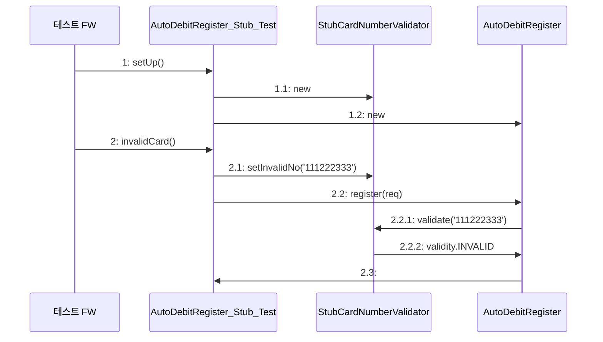

# 대역

## 대역 필요성

테스트 작성하다 보면 외부 요인이 필요한 시점이 있는데, 다음이 주요 예

- 테스트 대상에서 파일 시스템을 사용
- 테스트 대상에서 DB로부터 데이터를 조회하거나 데이터를 추가
- 테스트 대상에서 외부의 HTTP 서버와 통신

테스트 대상이 위와 같은 외부 요인에 의존하면 테스트 작성 후 실행하기 힘들다.
TDD는 `테스트 작성`->`통과시킬 만큼 구현`-> `리팩토링` 의 과정을 짧은 흐름으로 반복해야 함.

외부 요인은 테스트 작성을 어렵게 만들 뿐만 아니라 테스트 결과도 예측할 수 없게 만듬

- ex) 카드 정보 검사 대행 업체에서 테스트 할 때 사용하라고 제공한 카드 번호의 유효기간이 한 달 뒤일 수 있음.
  - 이 카드번호를 사용해서 성공한 자동이체 정보 등록 기능 테스트는 한 달 뒤에 유효기간 만료로 실패하게 됨.

테스트 대상이 외부 요인에 의존하여 테스트가 어려울 때는 대역을 써서 테스트를 진행할 수 있다.

## 대역을 이용한 테스트

대역의 종류는 스텁, 가짜, 스파이, 모의 객체가 존재하는데 각 대역 종류마다 쓰임새가 다르다.

대역을 이용해서 AutoDebitRegister를 테스트하는 코드를 작성해본다.
먼저 CardNumberValidator를 대신할 대역 클래스를 작성한다.

```java
public class StubCardNumberValidator extends CardNumberValidator {
    private String invalidNo;
    private String theftNo;

    public void setInvalidNo(String invalidNo) {
        this.invalidNo = invalidNo;
    }

    public void setTheftNo(String theftNo) {
        this.theftNo = theftNo;
    }

    @Override
    public CardValidity validate(String cardNumber) {
        if (invalidNo != null && invalidNo.equals(cardNumber)) {
            return CardValidity.INVALID;
        }
        if (theftNo != null && theftNo.equals(cardNumber)) {
            return CardValidity.THEFT;
        }
        return CardValidity.VALID;
    }
}
```

StubCardNumberValidator는 실제 카드번호 검증 기능을 구현하지 않는다. 대신 단순한 구현으로 실제 구현을 대체한다.

- validate() 메서드는 invalidNo필드와 동일한 카드번호면 결과로 INVALID를 리턴하고 그렇지 않으면 VALID를 리턴한다.

이제 이 StubCardNumberValidator를 이용해서 AutoDebitRegister를 테스트하는 코드를 작성해본다.

```java
public class AutoDebitRegister_Stub_Test{
	private AutoDebitRegister register;
	private StubCardNumberValidator stubValidator;
	private StubAutoDebitInfoRepository stubRepository;
	
	@BeforeEach
  void setUp() {
      stubValidator = new StubCardNumberValidator();
      stubRepository = new StubAutoDebitInfoRepository();
      register = new AutoDebitRegister(stubValidator, stubRepository);
  }

  @Test
  void invalidCard() {
      stubValidator.setInvalidNo("111122223333");

      AutoDebitReq req = new AutoDebitReq("user1", "111122223333");
      RegisterResult result = this.register.register(req);

      assertEquals(INVALID, result.getValidity());
  }
}
```

AutoDebitRegister는 실제 객체 대신에 StubCardNumberValidator를 사용해서 카드번호가 유효한지 검사하게 된다.




DB 연동 코드도 대역을 사용하기에 적합하다. 예를 들어 자동이체 정보의 DB 연동을 처리하는 리포지토리 인터페이스는 다음과 같다.

```java
public interface AutoDebitInfoRepository{
	void save(AutoDebitInfo info);
	AutoDebitInfo findOne(String userId);
}
```

이를 대역을 사용하면 DB 없이 AutoDebitRegister를 테스트할 수 있다. AutoDebitInfoRepository를 테스트 할수 있다.

AutoDebitInfoRepository의 대역 구현해보면 다음과 같다.

```java
import java.util.HashMap;
import java.util.Map;

public class MemoryAutoDebitInfoRepository implements AutoDebitInfoRepository{
    @Override
    public void save(AutoDebitInfo info) {
    }

    @Override
    public AutoDebitInfo findOne(String userId) {
        return null;
    }
}
```

- DB 대신 맵을 이용해서 자동이체 정보를 저장한다.
- 메모리에만 데이터가 저장되므로 DB와 같은 영속성을 제공하지 않지만, 테스트에 사용할 수 있는 만큼의 기능은 제공한다.

다음은 MemoryAutoDebitInfoRepository를 이용해서 테스트 코드를 작성한 예이다.

```java
import org.junit.jupiter.api.BeforeEach;
import org.junit.jupiter.api.Test;

import java.time.LocalDateTime;

import static autodebit.CardValidity.VALID;
import static org.junit.jupiter.api.Assertions.assertEquals;
import static org.junit.jupiter.api.Assertions.assertNotNull;

public class AutoDebitRegister_Fake_Test {
    private AutoDebitRegister register;
    private StubCardNumberValidator cardNumberValidator;
    private MemoryAutoDebitInfoRepository repository;

    @BeforeEach
    void setUp() {
        cardNumberValidator = new StubCardNumberValidator();
        repository = new MemoryAutoDebitInfoRepository();
        register = new AutoDebitRegister(cardNumberValidator, repository);
    }

    @Test
    void alreadyRegistered_InfoUpdated() {
        repository.save(
                new AutoDebitInfo("user1", "111222333444", LocalDateTime.now()));

        AutoDebitReq req = new AutoDebitReq("user1", "123456789012");
        RegisterResult result = this.register.register(req);

        AutoDebitInfo saved = repository.findOne("user1");
        assertEquals("123456789012", saved.getCardNumber());
    }

    @Test
    void notYetRegistered_newInfoRegistered() {
        AutoDebitReq req = new AutoDebitReq("user1", "1234123412341234");
        RegisterResult result = this.register.register(req);

        AutoDebitInfo saved = repository.findOne("user1");
        assertEquals("1234123412341234", saved.getCardNumber());
    }
}

```

`alreadyRegistered_InfoUploaded()` 메서드는 이미 자동이체 정보가 등록되어 있을 때 기존 정보가 올바르게 바뀌는지 검사하는 테스트 메서드이다.

- `repository = new MemoryAutoDebitInfoRepository();` : 메모리를 이용한 대역 객체인 MemoryAutoDebitInfoRepository를 생성한다.
- `register = new AutoDebitRegister(cardNumberValidator, repository);`: 테스트 대상인 AutoDebitRegister 객체를 생성할 때 대역을 전달한다.
- `repogitory.save(new AutoDebitInfo("user1","111222333444", LocalDateTime.now()));`: 이미 자동이체 정보가 등록되어 있는 상황을 만들기 위해 대역을 사용한다. 사용자 아이디 "user1"에 대한 자동이체 정보를 저장한다.
- `AutoDebitReq req = new AutoDebitReq("user1","123456789012");` 
  `RegisterResult result = this.register.register(req);`
  - "user1"아이디에 대해 다른 카드번호를 사용해서 자동이체 등록 기능을 실행 한다.
- `AutoDebitInfo saved = repository.findOne("user1");`
  `assertEquals("123456789012", saved.getCardNumber());`
  - 자동이체 등록 기능 실행 후 대역에 보관된 자동이체 정보를 구해서 값이 올바르게 변경되었는지 확인한다.

`notYetRegistered_newInfoRegistered()` 테스트 메서드는 아직 자동 이체 정보가 등록 되어 있지 않을때 새로운 정보가 올바르게 등록되는지 검사한다.

- 테스트 메서드를 실행할 때마다 (@BeforeEach를 붙인) `setUp 메서드`를 매번 실행 하므로 repository 대역에는 아직 어떤 자동이체 정보도 등록 되어 있지 않다.
- `AutoDebitReq req = new AutoDebitReq("user1","1234123412341234");`
  `RegisterResult result = this.register.register(req);`
  - 자동이체 등록 기능을 실행
- `AutoDebitInfo saved = repository.findOne("user1");`
  `assertEquals("1234123412341234", saved.getCardNumber());`
  - 대역에 보관된 자동이체 정보를 구해서 새로운 값이 올바르게 등록되었는지 확인한다.

### 대역을 사용한 외부 상황 흉내와 결과 검증

위 대역을 사용한 테스트에서 주목할 점은 다음 두 가지 없이 `AutoDebitRegister`에 대한 테스트를 수행했다는 점

- 외부 카드 정보 API 연동
- 자동이체 정보를 저장한 DB

`stubCardNumberValidator` 를 사용해서 유효하지 않은 카드번호에 대한 테스트 수행하여 외부 업체에서 제공하는 카드 정보 API 연동 없이 AutoDebitRegister가 유효하지 않은 카드번호에 대해 올바르게 동작하는지 확인 할 수 있었다.

`MemoryAutoDebitInfoRepository`를 사용하여 메모리를 통해 데이터가 올바르게 바뀌고 저장되는지 확인했다.
실제 DB를 연동하지 않고 AutoDebitRegister가 데이터 저장소에 데이터를 올바르게 반영하는지 확인할 수 있었다.

## 대역의 종류

| **대역 종류** | **설명**                                                     |
| ------------- | ------------------------------------------------------------ |
| 스텁(Stub)    | 구현을 단순한 것으로 대체, 테스트에 맞게 단순히 원하는 동작을 수행한다. |
| 가짜(Fake)    | 제품에는 적합하지 않지만, 실제 동작하는 구현을 제공한다. DB대신에 메모리를 이용해서 구현하는 방법 |
| 스파이(Spy)   | 호출된 내역을 기록한다. 기록한 내용은 테스트 결과를 검증할 때 사용한다.(`스텁이기도 하다.`) |
| 모의(Mock)    | 기대한 대로 상호작용하는지 행위를 검증한다. 기대한 대로 동작하지 않으면 익셉션을 발생할 수 있다. `모의 객체`는 `스텁`이자 `스파이`도 된다. |

### 약한 암호 확인 기능에 스텁 사용

- 암호를 확인하는 스텁용 클래스 `StubWeakPasswordChecker`를 생성한다.
- `StubWeakPasswordChecker` 클래스는 단순히 weak 필드 값을 반환하는 방식으로 암호를 확인한다.
- 실제 테스트 클래스에 스텁 클래스를 주입한다.
- 테스트 클래스에서 암호 확인 기능을 수행할 때 스텁 클래스에서 결과를 반환한다.

### 리포지토리를 가짜 구현으로 사용

- `Repository`와 동일하게 동작하는 `MemoryUserRepository`를 생성한다.
- `MemoryUserRepository`는 요청이 들어오면 DB 대신 메모리에 접근하도록 구현한다.
- `MemoryUserRepository`를 테스트 클래스에 주입한다.
- 테스트 클래스 수행 시 동일한 로직을 수행하면서 `DB 접근`을 `메모리 접근`으로 대체한다.

### 이메일 발송 여부를 확인하기 위해 스파이 사용

- 이메일 발송 여부를 확인해주는 `SpyEmailNotifier` 클래스를 생성한다.
- `SpyEmailNotifier`의 이메일 전송 요청을 호출하면 내부의 발송 상태를 true로 변경한다.
- `SpyEmailNotifier`를 테스트 클래스에 주입한다.
- 테스트 클래스 수행 시 이메일 전송 요청 후 발송 여부를 확인한다. 요청 시 이메일 발송 여부는 true로 변경되어 테스트가 정상적으로 수행됨을 확인할 수 있다.

### 모의 객체로 스텁과 스파이 대체

`Mockito`를 사용하면 스텁과 스파이를 대체할 수 있다. 모의 객체는 대역 객체가 기대하는 대로 상호작용했는지 확인하는 것이 주요 기능이다. `Mockito`를 사용하면 `모의 객체`가 기대한 대로 호출되었는지 검증할 수 있다.

## 상황과 결과 확인을 위한 협업 대상(의존) 도출과 대역 사용

제어하기 힘든 외부 상황이 존재할 경우 다음과 같은 방법으로 의존을 도출하고 이를 대역으로 대신할 수 있다.

- 제어하기 힘든 외부 상황을 별도 타입으로 분리한다.
- 테스트 코드는 별도로 분리한 타입의 대역을 생성한다.
- 생성한 대역을 테스트 대상의 생성자 등을 이용해서 전달한다.
- 대역을 이용해서 상황을 구성한다.

## 대역과 개발 속도

TDD 과정에서 대역을 사용하지 않고 실제 구현을 사용하면 다음과 같은 일이 발생한다.

- 카드 정보 제공 업체에서 도난 카드번호를 받을 때까지 테스트를 기다린다.
- 카드 정보 제공 API가 비정상 응답을 주는 상황을 테스트하기 위해 업체의 변경 대응을 기다린다.
- 회원 가입 테스트 후 메일함에 편지가 도착할 때까지 기다린다.
- 약한 암호 검사 기능을 개발할 때까지 회원 가입 테스트를 대기한다.

이런 경우 모두 대기 시간이 발생한다. 대역을 사용하면 실제 구현이 없어도 다양한 상황을 테스트할 수 있다. 또한, 대역을 사용하면 실제 구현이 없어도 실행 결과를 확인할 수 있다.

따라서, 대역은 의존하는 대상을 구현하지 않아도 테스트 대상을 완성할 수 있게 하며, 이는 대기 시간을 줄여 개발 속도를 올리는 데 도움이 된다.

## 모의 객체를 과하게 사용하지 않기

모의 객체를 이용하면 대역 클래스를 만들지 않아도 되어 처음에는 편리하다. 하지만 결과 값을 확인하는 수단으로 모의 객체를 사용하기 시작하면 결과 검증 코드가 길어지고 복잡해진다. 특히, 하나의 테스트를 위해 여러 모의 객체를 사용하기 시작하면 결과 검증 코드의 복잡도는 배가 된다. 모의 객체는 기본적으로 메서드 호출 여부를 검증하는 수단이기 때문에 테스트 대상과 모의 객체 간의 상호작용이 조금만 바뀌어도 테스트가 깨지기 쉽다.

따라서, 모의 객체의 메서드 호출 여부를 결과 검증 수단으로 사용하는 것은 주의해야 한다. 특히, DAO나 리포지토리와 같은 저장소에 대한 대역은 모의 객체를 사용하는 것보다 메모리를 이용한 가짜 구현을 사용하는 것이 테스트 코드 관리에 유리하다.